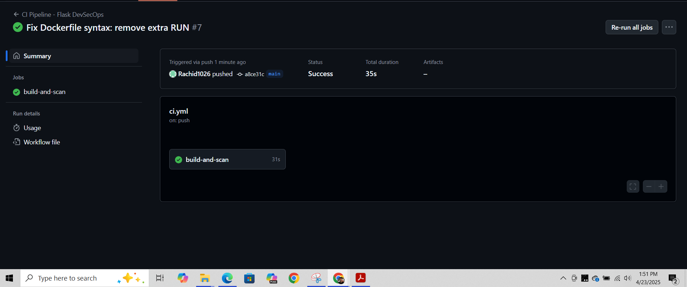

# Secure Flask DevSecOps CI Pipeline

This project demonstrates how to implement a secure CI/CD pipeline for a simple Flask application using GitHub Actions. The pipeline performs both static code analysis and container vulnerability scanning as part of a DevSecOps workflow.

It automatically runs on every push to the `main` branch and includes steps to lint Python code using Bandit, build a Docker image, and scan it with Trivy for known vulnerabilities.

---

##  Features

- CI/CD pipeline with GitHub Actions
- Python static code security scan using **Bandit**
- Docker image build and security scan using **Trivy**
- Professional `requirements.txt` for dependency management
- Properly structured `Dockerfile` with Flask app
- Secure-by-default deployment practices (DevSecOps mindset)

---

##  Technologies Used

- Python 3.11  
- Flask  
- Bandit  
- Docker  
- Trivy  
- GitHub Actions

---

##  How to Run

1. Clone the repo and navigate into it  
2. Make sure `requirements.txt` and `Dockerfile` are in place  
3. GitHub Actions will trigger automatically on push  
4. CI pipeline runs:  
   -  Lints the code with Bandit  
   -  Builds Docker image  
   -  Scans container with Trivy  

> Make sure to enable GitHub Actions if working from a fork

---

##  CI/CD Pipeline Output

Below is a screenshot showing a successful end-to-end DevSecOps pipeline run:

---

##  Author

**Rachid Dwyer**  
[GitHub Profile](https://github.com/Rachid1026)  
Refonte Cybersecurity Internship Project – 2025
